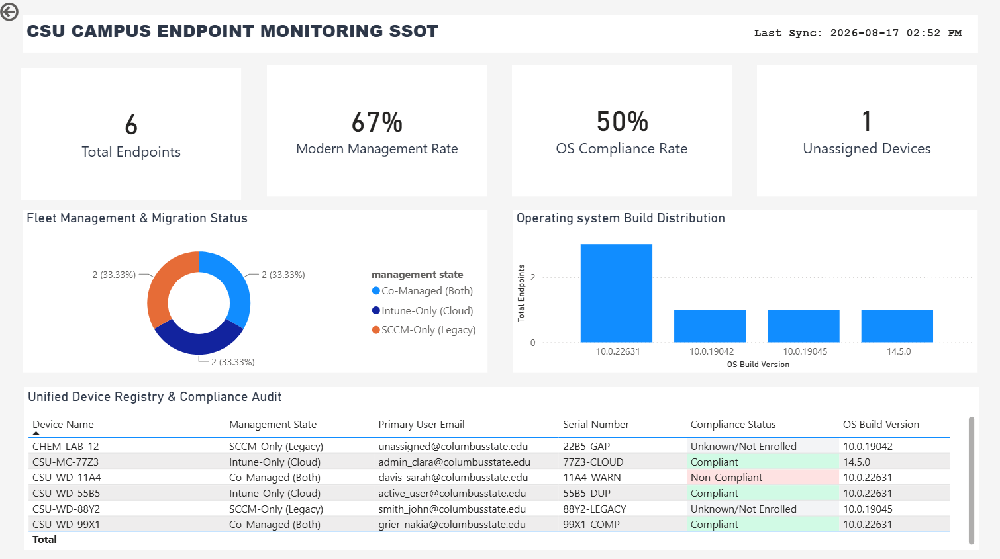

# 🚀 CSU Campus Endpoint Monitoring Single Source of Truth (SSOT)

An enterprise-grade, automated ELT (Extract, Load, Transform) data integration pipeline and interactive compliance dashboard. This project consolidates disparate campus hardware directories—legacy Microsoft SCCM and modern cloud-native Microsoft Intune—into an audited Microsoft SQL Server database, resolving identity conflicts, executing defensive deduplication, and delivering real-time executive analytics.

---

### 📊 Operational & Fleet Integrity Dashboard
Below is the live operational preview of the reconciled campus fleet, powered directly by our database's semantic view layer:



---

### 🔍 Executive & Technical Highlights

*   **Defensive Ingestion Engine:** Automated Python ETL scripts utilizing Pandas and SQLAlchemy to clean character encodings (UTF-8/ANSI) and bulk-load raw CSV files into SQL Server staging tables.
*   **Immutable Historical Audit Ledger:** A robust T-SQL `MERGE` routine that updates, appends, and deduplicates records without risking destructive data deletions.
*   **Priority-Based Coalescing:** Smart business logic that matches records across systems by serial number, prioritizing cloud-managed Intune values for hostnames and user emails while retaining legacy SCCM resource connections as operational fallbacks.
*   **Left-Shifted Analytical View:** A production SQL view (`dbo.vw_powerbi_unified_endpoints`) that computes complex compliance states and unassigned device flags on the database engine, preserving Power BI desktop memory limits and keeping visuals fast.
*   **Key Performance Indicators (KPIs):** Custom DAX calculations tracking fleet size, modern management rates, patch compliance, and "Ghost Devices" (networked machines missing active user owners).# University Asset SSOT Data Pipeline

A professional-grade, multi-source data integration engine that consolidates campus hardware assets from Microsoft SCCM and Microsoft Intune into a secure, centralized SQL Server database—establishing a Single Source of Truth (SSOT) and powering an interactive Power BI compliance dashboard.

---

## 🗺️ System Architecture

Our data pipeline follows a secure, modern **ELT (Extract, Load, Transform)** pattern to ingest, clean, and reconcile campus endpoints:

```
[ Raw CSV Exports ] (SCCM & Intune)
       │
       ▼ (Python Ingestion Script)
[ Staging Layer ] (dbo.stg_sccm_endpoints & dbo.stg_intune_endpoints)
       │
       ▼ (T-SQL Stored Procedure with Window Functions & Upsert)
[ Dimension Layer ] (dbo.dim_unified_endpoints - Production SSOT)
       │
       ▼ (T-SQL Reporting View)
[ Semantic View ] (dbo.vw_powerbi_unified_endpoints)
       │
       ▼ (Direct Import Mode via Windows Auth)
[ Power BI Dashboard ] (Interactive Executive & Operational Hub)
```

---

## 📂 Repository File Structure

This repository is organized using industry-standard project conventions to maintain a clean separation of concerns:

```
University-Asset-SSOT/
│
├── sql/
│   ├── schemas/
│   │   ├── 01_table_schemas.sql       # Staging and Production DDL table schemas
│   │   ├── 02_stored_procedure.sql    # Reconciliation stored procedure (Deduplication & Upserts)
│   │   └── 04_audit_reconciliation.sql# SQL Regression Testing & QA Auditing Suite
│   │
│   └── views/
│       └── 03_reporting_view.sql      # Power BI Semantic Layer view
│
├── src/
│   ├── __init__.py
│   ├── ingestion/
│   │   ├── load_staging.py            # Python automated SQL Server bulk ingestion script
│   │   └── profile_headers.py         # Python utility for raw CSV header profiling
│   │
│   └── matching/
│       └── merge_assets.py            # Python experimental asset mapping and mapping specs
│
├── images/
│   ├── dashboard_preview.png          # Visual screenshot of the finished Power BI Dashboard
│   └── data_model.png                 # Relationship diagram of the Star Schema model
│
├── .gitignore                         # Secure boundary blocking raw .csv/data/ from Git exposure
├── Campus-Endpoint-Dashboard.pbit     # Secure, empty Power BI template (metadata only)
├── README.md                          # Executive project overview and deployment guide
└── operations-runbook.md              # Technical operations and troubleshooting manual
```

---

## 🛠️ Setup & Deployment Guide

Follow these steps to deploy this pipeline on your local workstation:

### 1. Database Configuration (SQL Server)
1. Open **SQL Server Management Studio (SSMS)** and connect to your local database instance (e.g., `localhost\SQLEXPRESS`).
2. Open and execute the SQL scripts in order:
   * Run `sql/schemas/01_table_schemas.sql` to create your database and staging/production tables.
   * Run `sql/schemas/02_stored_procedure.sql` to build the reconciliation stored procedure.
   * Run `sql/views/03_reporting_view.sql` to establish the Power BI semantic view.

### 2. Python Environment Setup
1. Open your terminal in VS Code and install the SQL Server connection drivers:
   ```bash
   pip install sqlalchemy pyodbc pandas openpyxl
   ```
2. Place your raw system exports in your local workspace:
   * Save your SCCM CSV export as: `data/raw/SCCM.csv`
   * Save your Intune CSV export as: `data/raw/Intune.csv`

### 3. Run the Automated Ingestion
1. Execute the Python loader script to clean staging and bulk-insert raw CSV rows:
   ```bash
   python src/ingestion/load_staging.py
   ```
2. Execute the reconciliation engine inside SSMS or call it via Python to merge the staging rows into the production dimension:
   ```sql
   EXEC dbo.sp_reconcile_endpoints;
   ```

### 4. Open the Power BI Dashboard Template
1. Open `Campus-Endpoint-Dashboard.pbit` in **Power BI Desktop**.
2. When prompted, enter your local SQL Server instance name (`localhost\SQLEXPRESS`) to automatically bind the report to your local `vw_powerbi_unified_endpoints` view using secure Windows Authentication.

---

## 📊 Power BI Analytics & Star Schema Model

### Executive Dashboard Metrics
Our reporting layout leverages direct database-computed attributes to feed high-impact, lightweight visual components:
* **Modern Management Rate:** A percentage-based donut chart tracking our transition from legacy SCCM on-premises management to Intune cloud co-management.
* **Identity Completeness Rate:** An operational audit card highlighting devices that lack assigned primary users, helping local support teams track missing assets.
* **Active Exception Grid:** A table visual displaying real-time compliance failures, highlighting vulnerable devices for active physical verification.

### Core Data Model
The semantic model utilizes a strict star-schema structure. Rather than joining heavy text strings, Power BI links reporting logs and department details directly on the unified integer surrogate key `ssot_device_key` for lightning-fast report performance.

---

## 🔒 Security & Compliance Boundary

This repository is strictly designed to enforce **Data Governance & Privacy**:
* **Zero University Data Leakage:** The `.gitignore` file is hard-coded to ignore the `data/` directory and all raw `*.csv` files, preventing sensitive corporate information (such as hostnames, serial keys, and personal emails) from being uploaded to GitHub.
* **No Hardcoded Credentials:** The Python database adapter utilizes local **Windows Integrated Security** (`Trusted_Connection=yes`), ensuring that no database passwords or private network configurations are hardcoded into public scripts.

## About Me

[](https://linkedin.com/in/Nakia-Grier)
